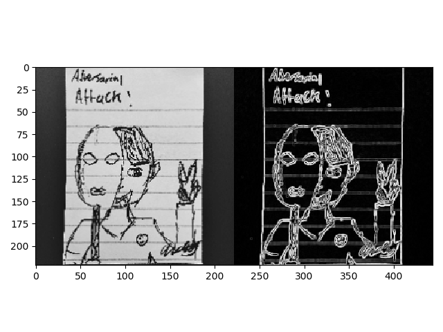
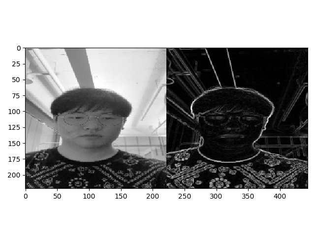
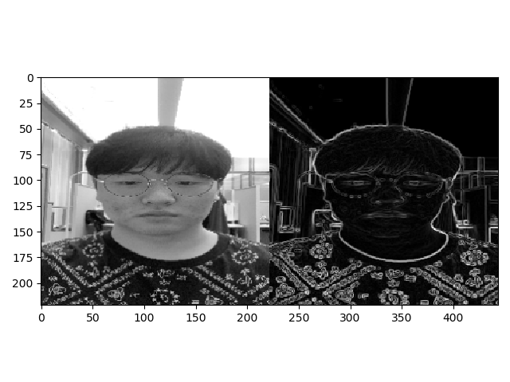
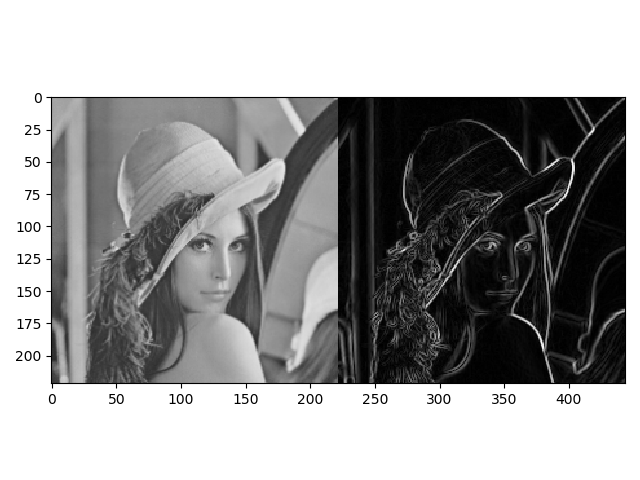

# sobel-operator-python

## Introduction
This repo is Sobel edge detection implemented on PyTorch.
Sobel edge detection works by sliding a kernel and performing [cross correlation](https://en.wikipedia.org/wiki/Cross-correlation) operation. 

Since Conv2d in PyTorch (and other frameworks like Tensorflow or Keras) is essentially an optimized implementation of cross correlation operation, 
we can take advantage of this to perform Sobel Edge detector in a very quick and optimized way.

This is expandable to other filters that utilizes cross correlation operation such as Gaussian Blur, and Laplacian.

## Running the Code
```bash
python main.py
```

## Requirements
```text
torch 1.4.0
numpy 1.18.1
opencv-python 4.2.0.34
```

## Results




